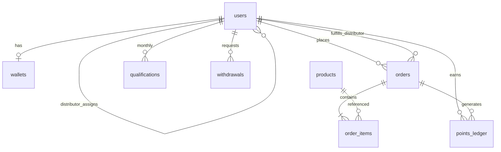

# Frosty Rewards System — Architecture Audit & Corrected Specification

**Audit date:** 2026-05-21  
**Status:** Corrected design ready for implementation (reconcile existing codebase to this document)

---

## 1. Executive summary

The business rules in your latest specification are mostly coherent. The **current prototype implementation** diverges in several **critical** areas:

| Area | Spec intent | Current code issue | Severity |
|------|-------------|-------------------|----------|
| Peso per point | **₱1 per point** (2 pts → ₱2 per softserve unit) | `peso_per_point = 2` in config | **Critical** |
| Override direction | Uplines L1–L4 earn when **downline** purchases; earner must be qualified | Requires **buyer** qualified before any override | **Critical** |
| OverrideEngine service text | “Fetch **downline** points L1–L4” | Uses upline walk (direction OK per-order) but wrong qualification gate | **High** |
| `genealogy_level` on `users` | Implied 0–4 | Stored as unbounded tree depth (up to 99) | **High** |
| Qualification rollover | Calendar month only (no cross-month rollover) | Partially OK; old “rollover” wording removed in new spec | **Medium** |
| `orders.source` | Who placed order / routing | Mixed routing + role semantics | **Medium** |
| Order status | Includes `completed` | Only `pending`, `approved`, `rejected` | **Low** |
| Withdrawals | Finance-controlled | No balance hold; double-request risk | **Medium** |
| Finance reports | Required for Finance Admin | Not defined | **Low** |

This document is the **canonical corrected architecture**. Implementation should be refactored to match Section 8+.

---

## 2. Core concepts (definitions)

### 2.1 Roles

| Role | Code | Earns rebates | Places orders | Approves orders |
|------|------|---------------|---------------|-----------------|
| Super Admin | `super_admin` | No | No | All (override) |
| Purchasing Admin | `purchasing_admin` | No | No | Main-fulfillment queue |
| Finance Admin | `finance_admin` | No | No | Withdrawals |
| IT Admin | `it_admin` | No | No | Settings/logs |
| Distributor | `distributor` | **Never** | Yes (to Main) | Operator orders routed to them |
| Operator | `operator` | Yes (self + override) | Yes | No |

### 2.2 Two independent trees on `users`

Do not conflate these:

1. **Sponsor genealogy** (`sponsor_id`) — who referred whom; drives override Levels 1–4.
2. **Fulfillment assignment** (`distributor_id`) — which Distributor fulfills the Operator’s orders (operational routing only).

An Operator’s sponsor and assigned Distributor are **different relationships**.

### 2.3 Genealogy levels (always relative to one Operator)

Levels are **not** stored as 0–4 on the user row. They are computed relative to a context user `O`:

| Level | Meaning |
|-------|---------|
| **0** | `O` (self) |
| **1** | Direct referrals of `O` (`sponsor_id = O.id`) |
| **2** | Referrals of Level 1 |
| **3** | Referrals of Level 2 |
| **4** | Referrals of Level 3 |

**Overrides apply only to Levels 1–4** (upline distances 1–4 from a **buying** Operator).

### 2.4 “Main” representation (canonical)

**Use `orders.distributor_id IS NULL` = fulfillment by Main (Purchasing Admin queue).**

Do **not** create a fake “Main” distributor user unless you need one for reporting labels in UI.

Optional explicit flag (redundant but readable):

```text
orders.fulfillment_channel ENUM('main','distributor') NOT NULL
-- 'main' => distributor_id MUST be NULL
-- 'distributor' => distributor_id MUST NOT be NULL
```

Enforce in application validation (CHECK constraint or model observer).

---

## 3. Product rules (validated)

| Category | Points per unit | Rebate-eligible |
|----------|-----------------|-----------------|
| `softserve` | 2 | Yes |
| `supply` / `supplies` | 0 | No |

**Softserve catalog (seed):** Vanilla, Chocolate, Ube, Strawberry, Mango.

**Supply examples:** Chocolate Dip, Chocolate Syrup; Purchasing Admin may add more with `points = 0`.

**Line points:** `order_items.points = products.points × qty` (snapshot at order time).

---

## 4. Qualification rules (corrected)

### 4.1 Rule

- Evaluated per **calendar month** (`YYYY-MM`).
- **Personal points** = sum of Level **0** points from **approved** Operator orders in that month (equivalently: sum of `points_ledger` where `user_id = operator`, `level = 0`, `type = self_rebate`, `month = M`).
- Threshold: **≥ 20** personal points → `qualified = true` for month M.
- **No cross-month rollover** of qualification progress. On the 1st of a new month, `personal_points` for the new month starts at 0.
- Personal points from purchases in month M **count toward M only**, even if qualification is reached late in M.

### 4.2 Clarified “rollover” wording

| Statement | Correct interpretation |
|-----------|------------------------|
| “Points roll over until 20 is reached” (legacy) | **Rejected.** Use calendar-month reset. |
| “If &lt; 20: no overrides” | **Override recipients** (qualified uplines) — see §5. |
| Self-rebate | **Always** paid on approval for Operator buyers, regardless of qualification. |

### 4.3 Ambiguity resolved: “Only if Level 0 is qualified”

**Means:** The **override earner** (the upline Operator at distance L) must be qualified **as their own Level 0** for month M.

**Does not mean:** The purchasing Operator (buyer) must be qualified for uplines to be paid.

---

## 5. Rebate & override rules (corrected)

### 5.1 Points and pesos

```
peso_per_point = 1.00   // configurable via system_settings
softserve_points_per_unit = 2
self_rebate_pesos = personal_points × peso_per_point
// Example: 1 softserve unit → 2 points → ₱2 self-rebate
```

### 5.2 Self-rebate (Level 0)

- **Who:** `users.role = operator` only.
- **When:** On order **approval** (not on submit).
- **Amount:** `order.total_points × peso_per_point`.
- **Ledger:** `points_ledger`: `level=0`, `type=self_rebate`, `user_id = buyer`, `source_user_id = buyer`.
- **Wallet:** Credit buyer.
- **Qualification:** Add `order.total_points` to buyer’s `qualifications.personal_points` for current month.

**Distributors:** May order; `processRebates` **must no-op** for non-operators (current behavior OK).

### 5.3 Override rebates (Levels 1–4)

Triggered on **same event** as self-rebate: order approval for an Operator buyer with `total_points > 0`.

**Algorithm (per approved order):**

```
buyer = order.user (must be operator)
month = order.month from approved_at (calendar month of approval timestamp)

for distance L in 1..4:
    upline = sponsor chain at distance L from buyer
    if upline is null or upline.role != operator: continue
    if NOT QualificationEngine.isQualified(upline, month): continue

    percent = settings.override_level_L_percent
    pesos = order.total_points × peso_per_point × (percent / 100)

    insert points_ledger(
        user_id = upline.id,
        source_user_id = buyer.id,
        level = L,
        points = order.total_points,  // basis points from this order
        pesos = pesos,
        type = override,
        month = month,
        order_id = order.id
    )
    credit wallet(upline, pesos)
```

**Remove** the gate `if (!isQualified(buyer)) return []` from OverrideEngine.

**Override basis:** Percent applied to **this order’s point volume** (not monthly aggregate). Monthly aggregation is only for qualification and reporting.

Configurable percents: `override_level_1_percent` … `override_level_4_percent` (IT/Super Admin settings).

### 5.4 Spec vs service naming alignment

| Spec service text | Correct behavior |
|-------------------|------------------|
| “Fetch downline points L1–L4” | Per-order: translate to “for each upline distance L, buyer is downline at level L relative to that upline.” Equivalent to sponsor chain walk. |
| QualificationEngine “sum Level 0 from ledger” | Source of truth = `points_ledger`; `qualifications` is a **cache** updated on each self-rebate. |

---

## 6. Ordering flow (corrected)

### 6.1 Operator order

**Form:** product, qty, fulfillment target (Distributor dropdown + “Main”).

**On submit:**

| Selection | `distributor_id` | `fulfillment_channel` | Approval queue |
|-----------|------------------|----------------------|----------------|
| Main | `NULL` | `main` | Purchasing Admin |
| Distributor X | `X.id` | `distributor` | Distributor X dashboard |

**Rebates:** Not calculated until approval.

### 6.2 Distributor order (to Main)

- `user_id` = distributor.
- `distributor_id` = `NULL`, `fulfillment_channel` = `main`.
- Approval: **Purchasing Admin only** (not Distributor self-approve).
- **No rebates** on approval.

### 6.3 Approval authority matrix

| Order type | Approver | Triggers rebates |
|------------|----------|------------------|
| Operator → Main | Purchasing Admin | Yes (operator buyer) |
| Operator → Distributor | That Distributor | Yes (operator buyer) |
| Distributor → Main | Purchasing Admin | No |

**Guard:** An order may be approved **once**. Add `approved_by`, `approved_at` on `orders`.

### 6.4 Status lifecycle

```
pending → approved → completed (optional logistics step)
        ↘ rejected
```

- **Rebates fire on `approved`** (not on `completed`).
- `completed` = Purchasing/Distributor marks fulfilled/shipped (optional phase 2).

---

## 7. Genealogy storage (corrected)

### 7.1 Fields

| Field | Purpose | Correction |
|-------|---------|------------|
| `sponsor_id` | Direct referrer (nullable for root operators) | Keep |
| `genealogy_path` | Materialized path `/1/5/23/` for subtree queries | Keep; index prefix |
| ~~`genealogy_level`~~ 0–4 on user | **Misleading** | **Rename** to `tree_depth` (unbounded) OR **remove** and compute depth from path |

**Do not** store “level 0–4” on the user row — those levels are relative per viewer.

### 7.2 GenealogyEngine responsibilities

**On Operator registration / referral:**

1. Set `sponsor_id`.
2. Build `genealogy_path = sponsor.genealogy_path + user.id + '/'` (or `/{id}/` if root).
3. Optionally set `tree_depth = sponsor.tree_depth + 1` (analytics only).

**downlinesByLevel(O, max=4):** BFS via `sponsor_id` (current approach is correct).

**uplineChain(buyer, max=4):** Walk `sponsor_id` up to 4 hops (current approach is correct).

**Optional optimization:** Query downlines with `genealogy_path LIKE '/{O.id}/%'` for large trees.

### 7.3 Sponsor constraints

- `sponsor_id` must reference an **Operator** (or Super Admin seed root — avoid; use company root operator).
- Prevent cycles (validate on save).
- Distributors **cannot** be sponsors; only Operators enter genealogy.

---

## 8. Corrected database schema

### 8.1 `users`

```sql
id                  BIGINT PK
name                VARCHAR(255)
email               VARCHAR(255) UNIQUE
password            VARCHAR(255)
role                ENUM('super_admin','purchasing_admin','finance_admin','it_admin','distributor','operator')
sponsor_id          BIGINT NULL FK → users.id  -- genealogy; operators only
genealogy_path      VARCHAR(500) NULL         -- e.g. /1/5/23/
tree_depth          SMALLINT UNSIGNED DEFAULT 0  -- optional; depth from root
distributor_id      BIGINT NULL FK → users.id  -- fulfillment assignment (operators)
status              ENUM('active','inactive','suspended')
email_verified_at   TIMESTAMP NULL
remember_token      VARCHAR(100) NULL
created_at, updated_at

INDEX idx_users_sponsor (sponsor_id)
INDEX idx_users_distributor_role (distributor_id, role)
INDEX idx_users_role_status (role, status)
INDEX idx_users_genealogy_path (genealogy_path(191))  -- prefix for MySQL
```

### 8.2 `products`

```sql
id          BIGINT PK
name        VARCHAR(255)
category    ENUM('softserve','supply')
price       DECIMAL(12,2)
points      INT UNSIGNED DEFAULT 0
status      ENUM('active','inactive')
sku         VARCHAR(64) NULL UNIQUE  -- optional future
timestamps

INDEX idx_products_category_status (category, status)
```

### 8.3 `orders`

```sql
id                      BIGINT PK
user_id                 BIGINT FK → users.id       -- who placed the order
distributor_id          BIGINT NULL FK → users.id  -- NULL = Main
fulfillment_channel     ENUM('main','distributor') NOT NULL
status                  ENUM('pending','approved','rejected','completed')
total_amount            DECIMAL(12,2)
total_points            INT UNSIGNED
approved_by             BIGINT NULL FK → users.id
approved_at             TIMESTAMP NULL
rejected_by             BIGINT NULL FK → users.id
rejected_at             TIMESTAMP NULL
created_at, updated_at

INDEX idx_orders_status_channel (status, fulfillment_channel)
INDEX idx_orders_distributor_status (distributor_id, status)
INDEX idx_orders_user_created (user_id, created_at)
```

**Remove** ambiguous `source` column; replace with `fulfillment_channel` + infer placer from `user.role`.

### 8.4 `order_items`

```sql
id          BIGINT PK
order_id    BIGINT FK → orders.id CASCADE
product_id  BIGINT FK → products.id RESTRICT
qty         INT UNSIGNED
price       DECIMAL(12,2)   -- snapshot
points      INT UNSIGNED    -- snapshot (product.points * qty)
timestamps

INDEX idx_order_items_order (order_id)
```

### 8.5 `points_ledger` (immutable financial event log)

```sql
id                BIGINT PK
user_id           BIGINT FK → users.id      -- earner
source_user_id    BIGINT NULL FK → users.id  -- who generated volume (buyer)
level             TINYINT UNSIGNED          -- 0=self, 1-4=override distance
points            INT UNSIGNED              -- basis points for this event
pesos             DECIMAL(12,2)
type              ENUM('self_rebate','override','adjustment')
month             CHAR(7)                   -- YYYY-MM
order_id          BIGINT NULL FK → orders.id
created_at, updated_at

INDEX idx_ledger_user_month (user_id, month)
INDEX idx_ledger_source_month (source_user_id, month)
INDEX idx_ledger_order (order_id)
UNIQUE idx_ledger_order_user_type_level (order_id, user_id, type, level)  -- idempotency
```

### 8.6 `qualifications` (monthly cache)

```sql
id                BIGINT PK
user_id           BIGINT FK → users.id
month             CHAR(7)
personal_points   INT UNSIGNED DEFAULT 0
qualified         BOOLEAN DEFAULT FALSE
qualified_at      TIMESTAMP NULL
timestamps

UNIQUE (user_id, month)
```

Rebuild rule: `personal_points = SUM(points_ledger.points WHERE user_id AND level=0 AND month)`.

### 8.7 `wallets`

```sql
id          BIGINT PK
user_id     BIGINT UNIQUE FK → users.id
balance     DECIMAL(12,2) DEFAULT 0
timestamps
```

### 8.8 `wallet_transactions` (recommended — was missing)

```sql
id            BIGINT PK
wallet_id     BIGINT FK
user_id       BIGINT FK
amount        DECIMAL(12,2)    -- signed: +credit, -debit
balance_after DECIMAL(12,2)
reference_type VARCHAR(32)     -- order_rebate, withdrawal, adjustment
reference_id   BIGINT NULL
created_at

INDEX (user_id, created_at)
```

### 8.9 `withdrawals`

```sql
id            BIGINT PK
user_id       BIGINT FK → users.id
amount        DECIMAL(12,2)
status        ENUM('pending','approved','rejected','paid')
processed_by  BIGINT NULL FK → users.id
notes         TEXT NULL
created_at, updated_at

INDEX idx_withdrawals_status (status)
INDEX idx_withdrawals_user (user_id)
```

**Rule:** On request, validate `amount <= wallet.balance`; on approve, debit wallet + write `wallet_transactions`. Optional: reserve balance while pending.

### 8.10 `system_settings` & `activity_logs`

Keep as implemented; keys:

- `qualification_points` (default 20)
- `peso_per_point` (default **1**)
- `override_level_1_percent` … `override_level_4_percent`

---

## 9. Services (corrected contracts)

### 9.1 `GenealogyEngine`

```php
assignGenealogy(User $operator, ?User $sponsor): User
downlinesByLevel(User $context, int $maxLevel = 4): array<int, Collection<User>>
uplineChain(User $buyer, int $maxLevel = 4): array<int, ?User>
validateSponsor(User $operator, ?User $sponsor): void  // no cycles, operator-only sponsors
```

### 9.2 `OrderEngine`

```php
create(User $placer, array $items, ?int $distributorId): Order
approve(Order $order, User $actor): Order   // authority checks + rebates
reject(Order $order, User $actor): Order
processRebates(Order $order): void          // operator-only; idempotent
```

**Idempotency:** Before creating ledger rows, check unique `(order_id, user_id, type, level)`.

### 9.3 `QualificationEngine`

```php
recordPersonalPoints(User $operator, int $points, string $month): Qualification
isQualified(User $operator, string $month): bool
rebuildFromLedger(User $operator, string $month): Qualification  // reconciliation job
```

**Source of truth:** `points_ledger` level 0; `qualifications` is cache.

### 9.4 `OverrideEngine`

```php
distributeForOrder(Order $order): array<PointsLedger>
// No buyer qualification gate
// Each upline L in 1..4: must be operator + qualified for month
```

### 9.5 `WalletService`

```php
ensureWallet(User $user): Wallet
credit(User $user, float $pesos, string $refType, ?int $refId): void
debit(User $user, float $pesos, string $refType, ?int $refId): void
```

---

## 10. Dashboards & permissions (validated matrix)

| Module | Super | Purchasing | Finance | IT | Distributor | Operator |
|--------|-------|------------|---------|-----|-------------|----------|
| Products CRUD | ✓ | ✓ | — | — | — | — |
| Orders → Main queue | ✓ | ✓ | — | — | Submit | Submit |
| Orders → Distributor queue | ✓ | — | — | — | Approve | Submit |
| Wallets / rebates view | ✓ | — | ✓ | — | — | Own |
| Withdrawals process | ✓ | — | ✓ | — | — | Request |
| Settings / override % | ✓ | — | — | ✓ | — | — |
| Activity logs | ✓ | — | — | ✓ | — | — |
| Operators list | ✓ | — | — | — | Assigned | — |
| Add referral | — | — | — | — | — | ✓ |
| Genealogy L0–L4 view | — | — | — | — | — | ✓ (show self + downlines) |
| Finance reports | ✓ | — | ✓ | — | — | — |

**Operator genealogy UI:** Show **Level 0 (self)** summary + Levels 1–4 tables (current view missing explicit L0 card).

**Finance reports (define for phase 1):**

- Monthly rebates by type (self vs override)
- Withdrawals summary
- Top operators by personal points
- Override payout by level

---

## 11. Implementation delta checklist (existing codebase)

Apply these changes when regenerating/refactoring code:

- [ ] Set `peso_per_point` default to **1** in `config/frosty.php` and seeder/settings UI label.
- [ ] Remove buyer qualification check in `OverrideEngine::distribute`.
- [ ] Replace `orders.source` with `fulfillment_channel`; enforce NULL `distributor_id` iff `main`.
- [ ] Rename or remove `users.genealogy_level` → `tree_depth`.
- [ ] Add `orders.approved_by`, `approved_at`; idempotency unique index on ledger.
- [ ] Add `wallet_transactions` table; wire credits/debits.
- [ ] `QualificationEngine::syncFromLedger` as authoritative rebuild path.
- [ ] Distributor orders: only Purchasing Admin may approve (verify routes).
- [ ] Operator genealogy page: include Level 0 self stats.
- [ ] Withdrawal: validate balance; optional pending hold.
- [ ] Add finance reports controller (Finance Admin).

---

## 12. ER diagram (relationships)



---

## 13. Final canonical constants

```php
// config/frosty.php (corrected defaults)
qualification_points = 20
peso_per_point = 1.0
softserve_points_per_unit = 2
override_level_1_percent = 10.0  // example; IT-configurable
override_level_2_percent = 5.0
override_level_3_percent = 3.0
override_level_4_percent = 2.0
max_override_distance = 4
main_fulfillment = distributor_id IS NULL
```

---

## 14. Sign-off

This document resolves ambiguities, fixes schema/normalization gaps, aligns service contracts with the business spec, and lists concrete deltas from the current Laravel prototype.

**Next step for development:** Implement migration `2026_05_21_120000_align_frosty_architecture.php` and refactor services per Section 11, using this file as the single source of truth.
